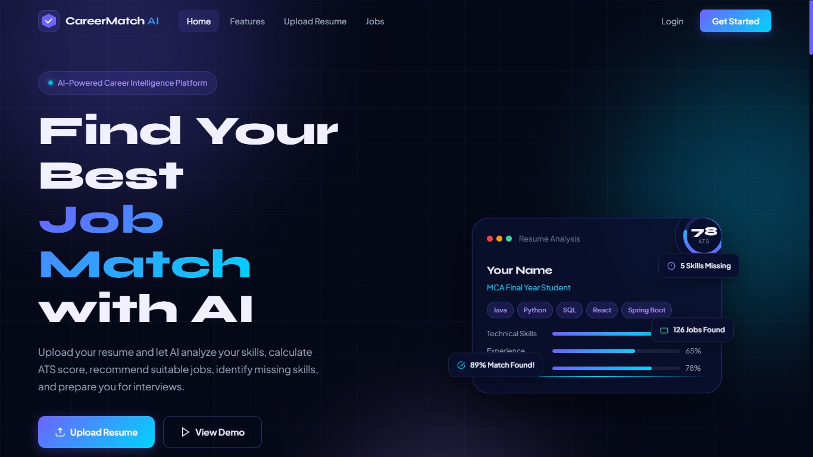
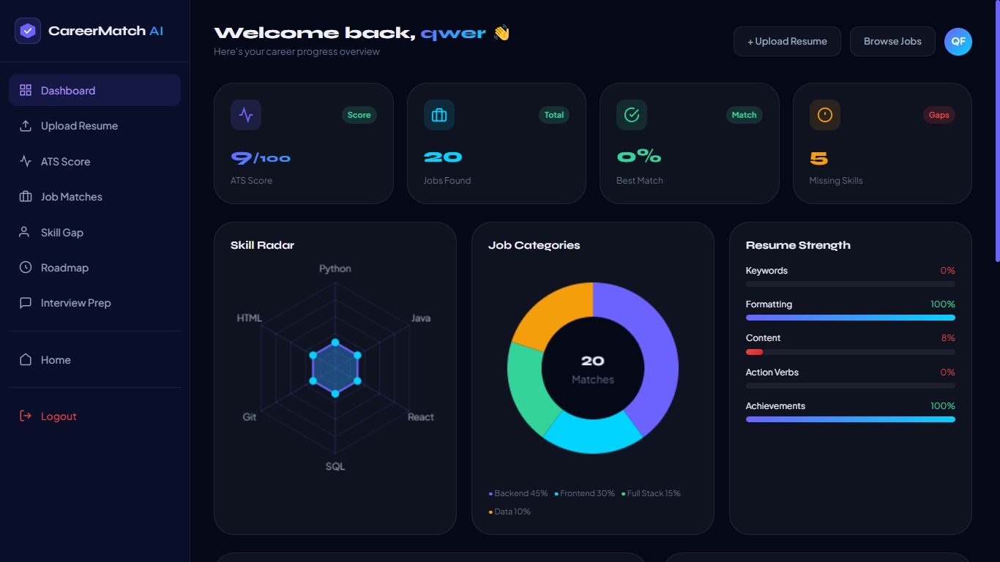
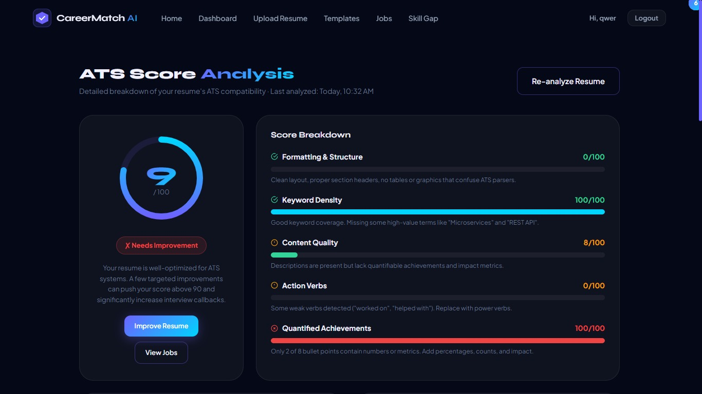
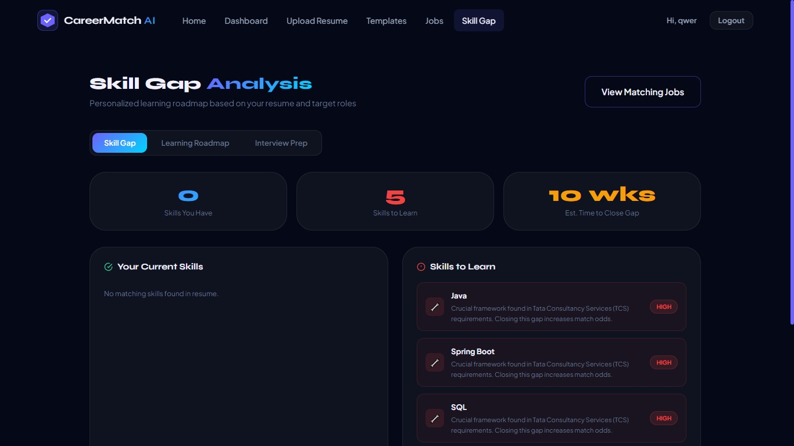

# 🚀 Carreermatch AI

Carreermatch AI ek smart full-stack web application hai jo users ko unki skills ke mutabik sahi career path aur jobs dhundhne mein madad karta hai. Isme ek powerful backend hai jo AI flows aur data processing ka use karke intelligent recommendations deta hai.

---

## 📸 Project Demo & Screenshots

| Home & Authentication | User Dashboard |
|---|---|
|  |  |

| ATS Score Checker | Skill Gap Analysis |
|---|---|
|  |  |

---

## ✨ Key Features (Mukhy Vaisheshtayein)

*   **Smart User Dashboard:** Users ko unke career progression aur saved jobs ka ek saaf-suthra overview dikhata hai.
*   **ATS Score Evaluation:** Resume ko analyze karke ATS (Applicant Tracking System) score batata hai taaki users apna resume behtar kar sakein.
*   **Skill Gap Analysis:** User ki maujuda skills aur market demand ke beech ka gap nikal kar unhe sahi skills seekhne ka sujhav deta hai.
*   **Secure Authentication:** User data ko surakshit rakhne ke liye ek proper login aur signup system (Auth) integrated hai.

---

## 🛠️ Tech Stack Used

*   **Frontend:** HTML5, CSS3, JavaScript (Interactions aur UI designs ke liye)
*   **Backend:** Python, Flask/FastAPI (AI workflows aur API endpoints handle karne ke liye)
*   **Database:** SQLite / Local Database (User aur job records store karne ke liye)

---

## 🚀 How to Run Locally (Apne Computer Par Kaise Chalayein)

1. Repository ko clone karein:
```bash
   git clone [https://github.com/peeyush689/Carreermatch-AI.git](https://github.com/peeyush689/Carreermatch-AI.git)
